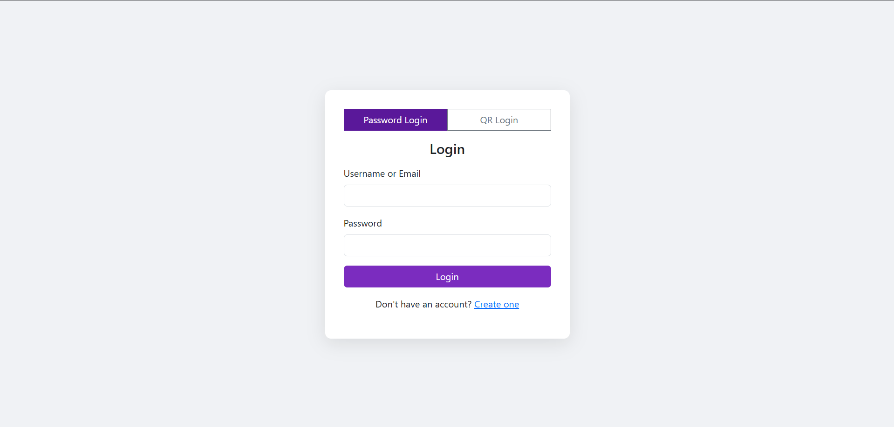
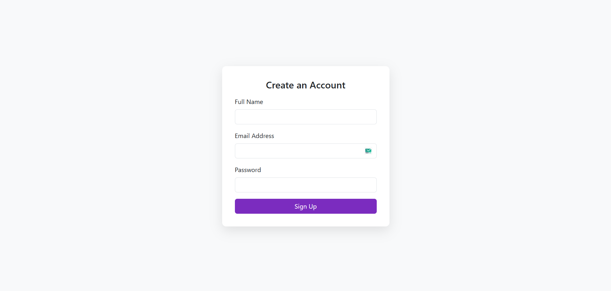

# 🔐 QR Code Based Login Authentication System

A secure and modern PHP-based authentication system that enables users to log in either with a traditional password or by scanning a unique QR code.

---

## 🖼️ Screenshots

### 🔐 Login Page


---

### 📝 Signup Page


---

### 📊 Dashboard with QR Download Option


---

## 📋 Table of Contents

- [Overview](#overview)
- [Features](#features)
- [How It Works](#how-it-works)
- [Technology Stack](#technology-stack)
- [Installation](#installation)
- [Usage Guide](#usage-guide)
- [Credits](#credits)

---

## 📌Overview

This project is a **login authentication system** that offers:

1. **Password-Based Login**
2. **QR Code-Based Login**

Users can choose to log in with a username-password combination or simply by scanning a QR code that uniquely identifies them.

---

## ✨Features

- Dual login options: **Password** or **QR Code**
- Secure QR generation using:
  - User ID
  - Email address
  - A server-side **secret phrase**
- QR code becomes **invalid if user data changes**
- Unique QR codes for each user session
- QR codes are downloadable from the dashboard
- Frontend styled using **Bootstrap 5**
- Backend built with secure, clean PHP code
- Integration with 3rd party QR Code API: [https://api.qrserver.com](https://api.qrserver.com)

---

## 🔧How It Works

### 🔑 Password Login
- User logs in using username and password
- If successful, they are redirected to the dashboard
- Dashboard provides a **"Download Login QR"** button

### 📱 QR Code Login
- QR code is generated using: `sha256 Hash`
- where `<HASH>` = `sha256(user_id + email + secret_phrase)`
- QR is valid only if the user ID and email remain unchanged
- If either is modified, QR becomes **instantly invalid**

---

## 🛠Technology Stack

- **Backend:** PHP (Pure PHP, no framework)
- **Frontend:** HTML5, CSS3, Bootstrap 5
- **Database:** MySQL
- **QR Code API:** [api.qrserver.com](https://api.qrserver.com)
- **Session Management:** PHP native sessions

---

## ⚙️Installation

### Prerequisites
- PHP >= 7.4
- MySQL
- Composer (for dependency management if extended)
- Web server (Apache, Nginx, or PHP built-in server)

### Steps

1. **Clone the Repository**
 ```bash
 git clone https://github.com/Rajdip585/qrcode-based-authentication.git
 cd qrcode-based-authentication
```

2. **Setup Database**
  - Create a MySQL database `qr-authentication`
  - Import the `qr-authentication.sql` file
  - Update Database credentials in `index.php` and `signup.php`

## 🧭Usage Guide

### 👤 Login via Password
  - Visit the login page
  - Enter username `abc@xyz.com` and password `12345678`
  - On success, redirected to dashboard

### 📥 Download QR Code
  - Click the Download Login QR button on dashboard
  - This will generate and download a unique QR code

### 📲 Login via QR Code
  - Visit the login page and choose Login via QR
  - Scan the previously downloaded QR
  - System validates it and logs you in if valid

## 🙌Credits
QR code generation powered by:
https://api.qrserver.com

Project developed by:
[Rajdip Patil](https://github.com/Rajdip585)
